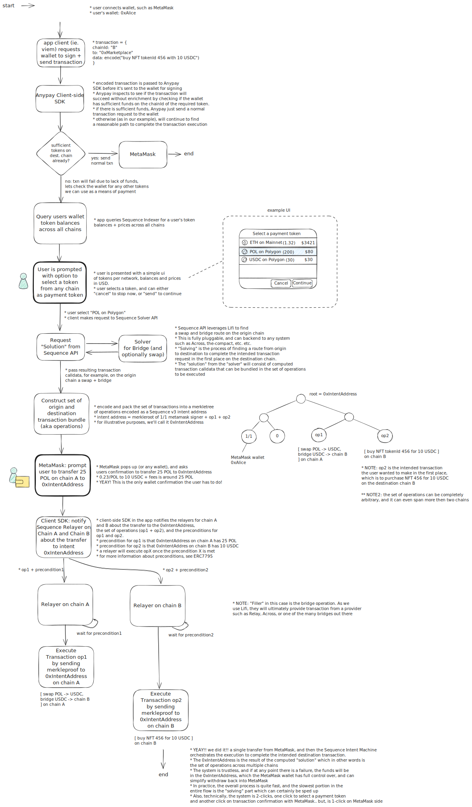

## Protocol Flow Overview

The Trails enables seamless cross-chain transactions through a coordinated system of intent contracts, relayers, and solvers. Below is the complete flow from user initiation to transaction completion.

## Key Components

### 🏗️ Architecture Layers

1. **User Interaction Layer**: Handles user requests and wallet interactions
2. **SDK Layer**: Manages balance queries, token selection, and orchestration
3. **Solver Layer**: Provides optimal routing solutions for cross-chain transfers
4. **Chain Layer**: Coordinates relayer operations across multiple blockchains
5. **Execution Layer**: Executes intent contracts and completes transactions

### 🔄 Protocol Flow

The protocol follows a systematic approach:

1. **Initiation**: User initiates a cross-chain transaction through their app
2. **Discovery**: SDK queries available token balances across all supported chains
3. **Selection**: User selects preferred payment token from any available chain
4. **Solution**: Sequence API provides optimal bridge/swap solution
5. **Execution**: Coordinated execution across origin and destination chains
6. **Completion**: Intent contracts fulfill the transaction requirements

### 🎯 Intent-Based Architecture

The protocol leverages intent contracts that:
- Define transaction requirements without specifying execution paths
- Enable flexible solver competition for optimal routes
- Provide atomicity guarantees across chain boundaries
- Support complex multi-hop operations seamlessly

### 🌉 Cross-Chain Coordination

Relayers on each chain work in concert to:
- Monitor intent contract states
- Execute transactions with cryptographic proofs
- Ensure atomic completion or rollback
- Maintain consistency across chain boundaries