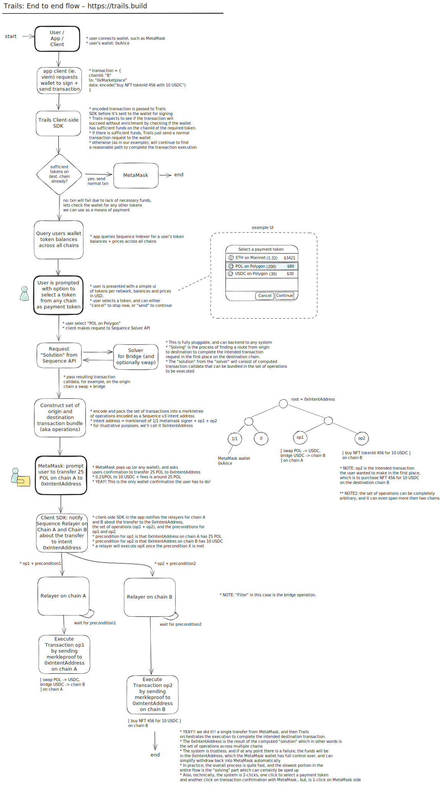
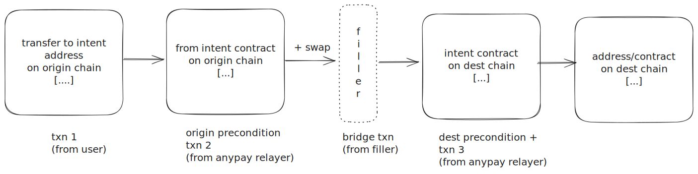

## Trails end-to-end Flow

Trails enables seamless cross-chain transactions through a coordinated system of intent contracts, relayers, and solvers. Below is the complete flow from user initiation to transaction completion.

<a href="https://mintlify.s3.us-west-1.amazonaws.com/anypay/images/trails-flow.svg" target="_blank">(click here to view diagram in full screen)</a>

Additionally, you can think of Trails as a pluggable transaction adapter that can execute any arbitrary transactions across multiple chains. See below.

## Under the Hood

Under the hood, Trails intents are counterfactual instantiations of [Sequence v3 account abstraction](https://github.com/0xsequence/wallet-contracts-v3) contracts. The Sequence v3 account abstraction contracts introduce a very flexible and novel execution model powered by merkle trees. The contract execution configuration is represented as a merkle tree that includes signers, a digest, a module, or a combination of all. The execution of the intent is triggered by a single transaction to the intent address, where the Trails relayers observe intent address and post merkle proofs onchain of the encoded sub-transactions on origin and destination chains. Please review the "Protocol Flow Overview" section above for more details.

TLDR: Trails successfully layers account abstraction transaction capabilities to primitive EOA wallets (even EOA wallets without ERC7702). This is the magic of the Trails design in how it can construct a single transaction with a single end-user confirmation that spans multiple chains and transactions. Trails also works with smart wallets directly, or ERC7702 wallets with some simplifications. The goal for Trails is to always make a simple route available for even the common denominator of wallets, such as an EOA without ERC7702.

Trails is architected as a trustless system that works on top of existing bridging / filler / solver infrastructure. 

For bridging / filling, Trails currently has integrated CCTPv2, Relay and Lifi.

## Key Components

### 🏗️ Architecture Layers

1. **User Interaction Layer**: Handles user requests and wallet interactions
2. **SDK Layer**: Manages balance queries, token selection, and orchestration
3. **Solver Layer**: Provides optimal routing solutions for cross-chain transfers
4. **Chain Layer**: Coordinates relayer operations across multiple blockchains
5. **Execution Layer**: Executes intent contracts and completes transactions

### 🔄 Protocol Flow

The protocol follows a systematic approach:

1. **Initiation**: User initiates a cross-chain transaction through their app
2. **Discovery**: SDK queries available token balances across all supported chains
3. **Selection**: User selects preferred payment token from any available chain
4. **Solution**: Sequence API provides optimal bridge/swap solution
5. **Execution**: Coordinated execution across origin and destination chains
6. **Completion**: Intent contracts fulfill the transaction requirements

### 🎯 Intent-Based Architecture

The protocol leverages intent contracts that:
- Define transaction requirements without specifying execution paths
- Enable flexible solver competition for optimal routes
- Provide atomicity guarantees across chain boundaries
- Support complex multi-hop operations seamlessly

### 🌉 Cross-Chain Coordination

Relayers on each chain work in concert to:
- Monitor intent contract states
- Execute transactions with cryptographic proofs
- Ensure atomic completion or rollback
- Maintain consistency across chain boundaries
