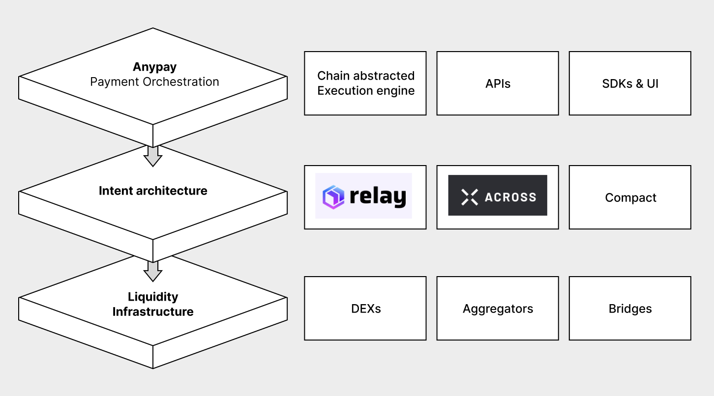

## Overview

The Payment Orchestration Protocol is a chain-abstracted payments architecture that enables lightning fast, simplified payments from any wallet seamlessly with **unified user liquidity**. In contrast to typical cross-chain infrastructure, the protocol sources liquidity and aggregates all user balances for every token across every chain in a user's wallet as options for any payment action on a destination chain such as a swap, deposit, mint, transfer, or trade.

## Key Features

### Universal User Liquidity
- Aggregates all user balances across every token and chain as payment options.
- Enables payments using any combination of available assets and chains, i.e., use 30 USDC from Optimism + Base to purchase NFT for 60 USDC.
- Leveraging existing liquidity infrastructure such as DEX's, bridges, or aggregators, we support a vast array of tokens and chains.

### Seamless Payments
- Payments occur in a single confirmation with any wallet, regardless if it's an EOA, account abstraction wallet, or EIP-7702 enabled.
- Developers simply specify payment intent (e.g., "purchase NFT #123 with 30 USDC") for a user to confirm.
- Built-in indexing to automatically return user's wallet data, transaction history, etc.

### Blazing Fast
- Fast from anywhere, even with payments across chains using our intent-based architecture & relayer infrastructure.
- Protocol intelligently detects optimal route for payment fulfillment.

### Scalable
- Anypay can leverage virtually any existing cross-chain or liquidity infrastructure.
- Relayer & Indexing infrastructure is lightweight and easily deployable to new chains.

## How AnyPay Stacks up

The Payment Orchestration Protocol is complementary to existing cross-chain infrastructure by leveraging various fillers & solvers as well as various DEX's and bridges for maximum liquidity across a wide variety of tokens:

## How it works

1. **Define Intent**: Create a payment transaction (mint, deposit, swap, etc) for any chain in any token.
2. **Anypay Inspects**: Can this succeed with the assets held on current chain? Yes = Pass through. No = Continue Orchestrating
3. **Select Route**: Anypay suggests the optimal tokens across chains — user can confirm or customize.
4. **Orchestrate Payment**: Intelligently combine swap + bridge + execute for the selected route.
5. **Execute Transaction**: User confirms transaction via their wallet which executes the end to end to flow for the selected payment.

This architecture enables developers to build sophisticated payment experiences while abstracting the underlying complexity of multi-chain operations - all you have to do is specify what payment to make.

## Integration

Simply add our SDK to your client-side application and specify the payment your want to make.

### Lightweight SDK
- **Built-in UI**: Ready-to-use widget interface with customizable branding
- **Headless**: Headless implementation for custom UX
- **Plug-and-play**: Minimal setup required for developers

